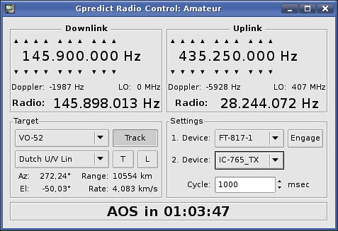

# GPredict

GPredict is a real time satellite tracking and orbit prediction program
for the desktop.

It uses the SGP4/SDP4 propagation algorithms together with NORAD two-line
element sets (TLE).

This repository contains the GPredict Satellite frequency information files.



The satellite control definition can be found at:
 ~/.config/Gpredict/trsp/<NORAD_NUM>.trsp and the structure is:

## Example RS-44:

```
# RS-44
[Mode Beacon]
DOWN_LOW=435605000
MODE=CW

[Mode V/U Lin]
UP_LOW=145935000
UP_HIGH=145995000
DOWN_LOW=435610000
DOWN_HIGH=435670000
INVERT=true
MODE=SSB/CW
```

## Usage:

You can clone this repository to a separate directory.

 If you have personal created satellite control files, make sure you make a backup first, after that copy the *.trsp to $HOME/.config/Gpredict/trsp.
